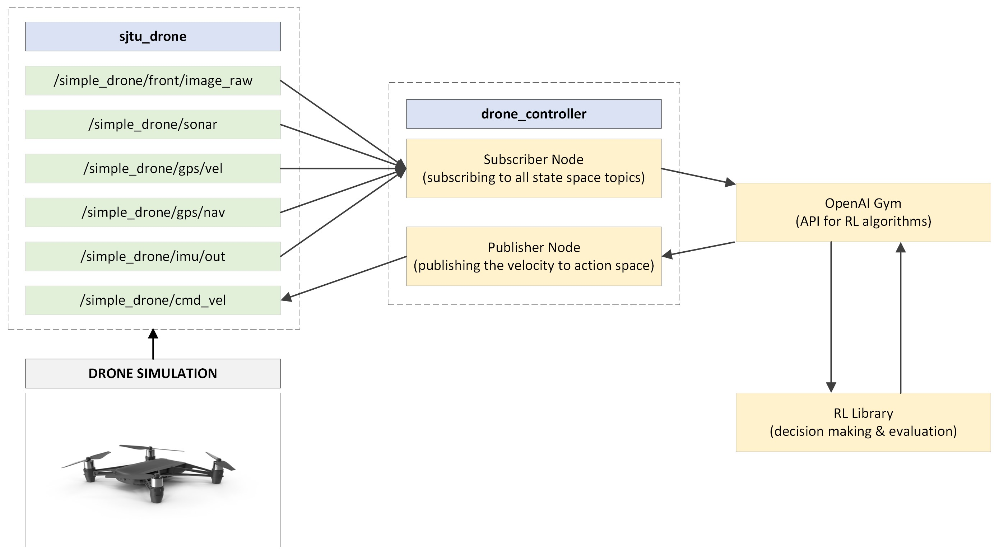
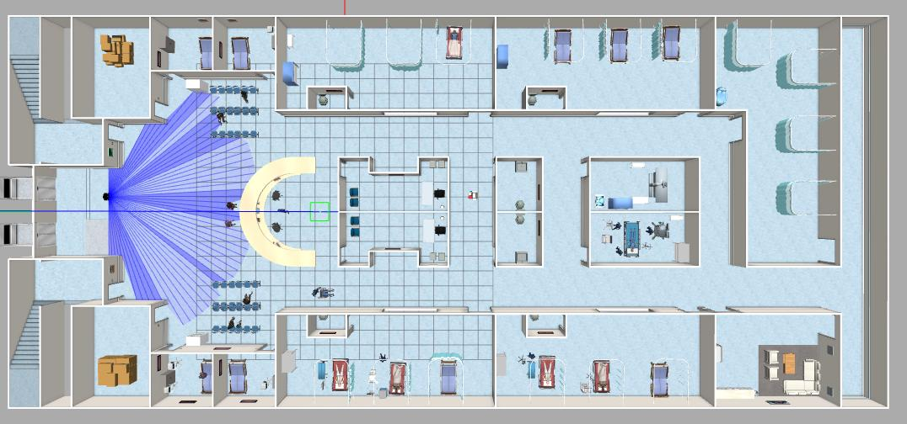

# Autonomous Drone Navigation using Reinforcement Learning

This repository contains a ROS2-based simulation and control for autonomous drone navigation using Reinforcement Learning (RL). The project aims to train a quadcopter to navigate a complex environment efficiently and safely, utilizing sensor data for obstacle avoidance and path planning.


## Overview

The core objective is to develop an intelligent drone capable of autonomous navigation in environments with obstacles. The drone is equipped with a LiDAR, IMU, and GPS sensor to perceive its surroundings and estimate its state. The project leverages ROS2 for inter-process communication and Gazebo for simulation. Reinforcement learning algorithms are employed to train the drone's control policy, enabling it to make optimal decisions for navigation.


## Sensor Specifications and Data Processing

The drone is equipped with the following sensors:

*   **LiDAR:** A 180° laser scanner for obstacle detection. The distance measurements are normalized to a range of 0 to 10 meters. Let $d_i$ represent the distance measurement from the $i$-th ray of the LiDAR. The normalized distance $d_i'$ is calculated as:

    $$
    d_i' = \frac{d_i}{10}
    $$

    where $d_i \in [0, 10]$ meters, and $d_i' \in [0, 1]$.
*   **IMU:** Measures the drone's orientation (roll, pitch, yaw) and angular velocities. Orientation is represented as a quaternion $q = w + xi + yj + zk$, and angular velocities are represented as a vector $\omega = [\omega_x, \omega_y, \omega_z]$.
*   **GPS:** Provides the drone's position in the world frame, represented as a 3D vector $p = [x, y, z]$.

## Project Structure

The repository is organized into several ROS2 packages:



*   **`sjtu_description`**: Contains the URDF (Unified Robot Description Format) files, meshes, and other resources that define the drone's physical model. This is based on the [SJTU Drone repository](https://github.com/NovoG93/sjtu_drone) but has been modified to include a LiDAR sensor.
*   **`sjtu_drone_control`**: Implements a low-level controller for the drone, responsible for stabilizing the drone and executing basic maneuvers.
*   **`sjtu_drone_bringup`**: Provides launch files to spawn the drone in the Gazebo simulation environment.
*   **`drone_control`**: Offers a higher-level interface for controlling the drone, allowing users to send commands such as "move to a specific location" or "follow a path."
*   **`drone_rl`**: Contains the core reinforcement learning code, including the custom Gymnasium environment, RL agent implementation, and training scripts.  Trained models are saved in the `drone_rl/models_rl` directory.

## Reinforcement Learning Setup

### State Space

The state space for the RL agent consists of the following elements:

*   Normalized LiDAR distances: $d' = [d_1', d_2', ..., d_n']$, where $n$ is the number of LiDAR rays.
*   Drone's orientation (quaternion): $q = [w, x, y, z]$.
*   Drone's linear velocity: $v = [v_x, v_y, v_z]$.
*   Relative position to the goal: $p_{relative} = [x_{goal} - x_{drone}, y_{goal} - y_{drone}, z_{goal} - z_{drone}]$.

### Action Space

The action space consists of the drone's control inputs:

*   Thrust: $T \in [T_{min}, T_{max}]$
*   Roll rate: $\dot{\phi} \in [\dot{\phi}_{min}, \dot{\phi}_{max}]$
*   Pitch rate: $\dot{\theta} \in [\dot{\theta}_{min}, \dot{\theta}_{max}]$
*   Yaw rate: $\dot{\psi} \in [\dot{\psi}_{min}, \dot{\psi}_{max}]$

### Reward Function

The reward function is designed to encourage the drone to reach the goal while avoiding obstacles. A simplified example is:

$R = R_{goal} + R_{obstacle} + R_{time}$

Where:
*   $R_{goal}$: Positive reward for approaching the goal.
*   $R_{obstacle}$: Negative reward for getting too close to obstacles.
*   $R_{time}$: Small negative reward per time step to encourage faster completion.

## Dependencies

*   ROS2 Humble (Ubuntu 22.04)
*   Gazebo
*   OpenAI Gymnasium
*   Stable Baselines3
*   aws-robomaker-hospital-world
*   Tensorboard
*   Optuna



## Build and Run Instructions

1.  **Clone the repository:**

    ```
    cd ~/ros2_ws/src
    git clone https://github.com/iamkrunalrk/reinforcement-learning-autonomous-drone-navigation.git
    ```

2.  **Build the project:**

    ```
    cd ~/ros2_ws/
    colcon build
    source ./install/setup.bash
    ```

3.  **Launch the simulation:**

    ```
    ros2 launch drone_rl drone_rl_start.launch.py
    ```

4.  **Start the RL training:**

    ```
    ros2 launch drone_rl start_training.launch.py
    ```

    This will start the training process, and the drone will begin exploring the environment. TensorBoard can be used to monitor the training progress.


